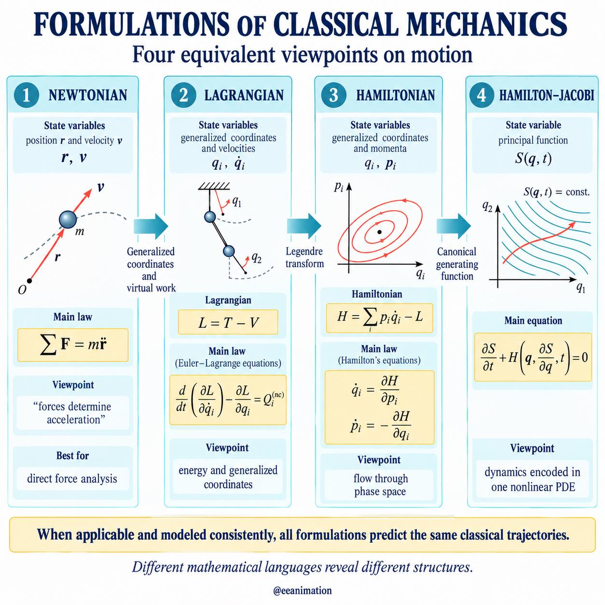
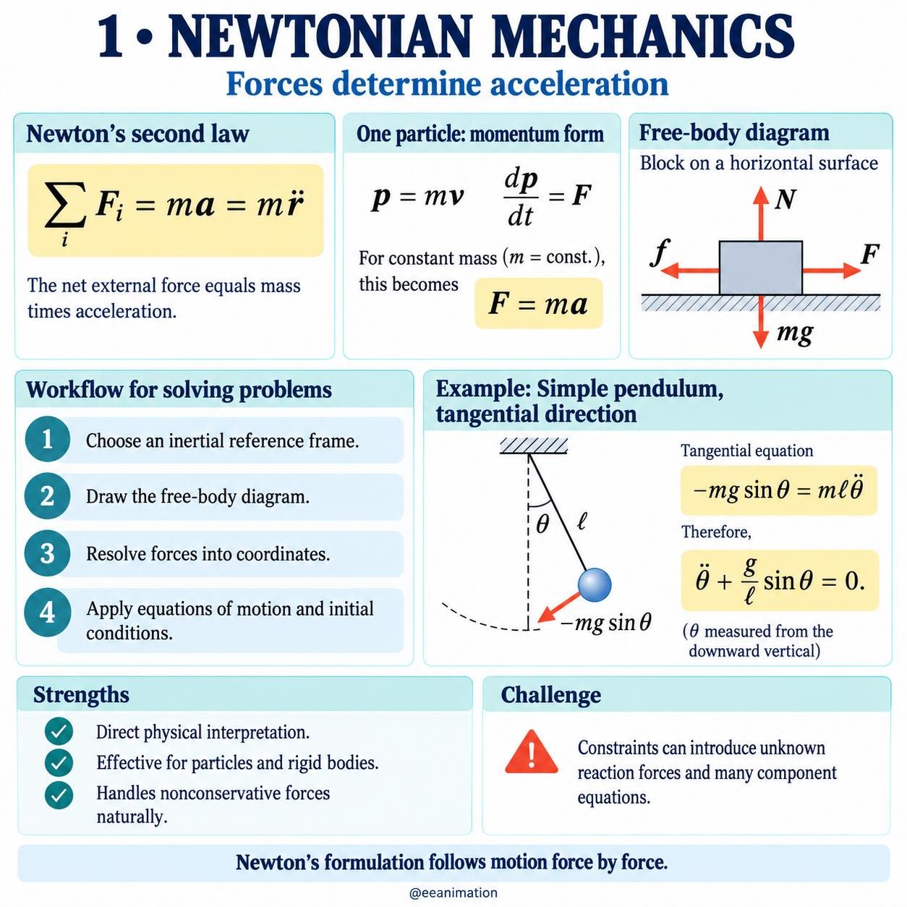
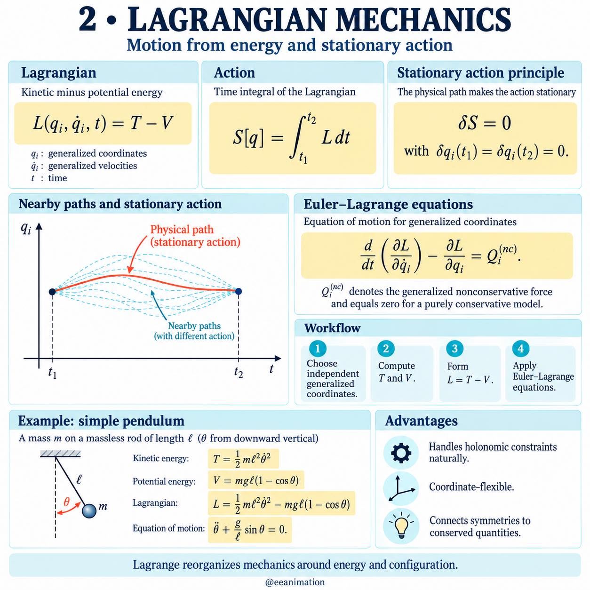
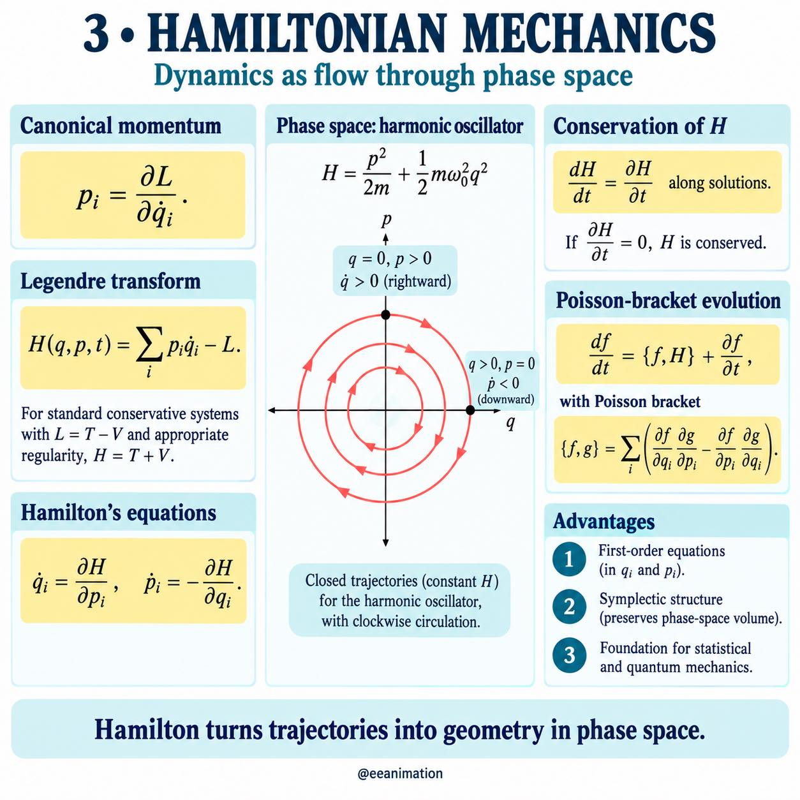
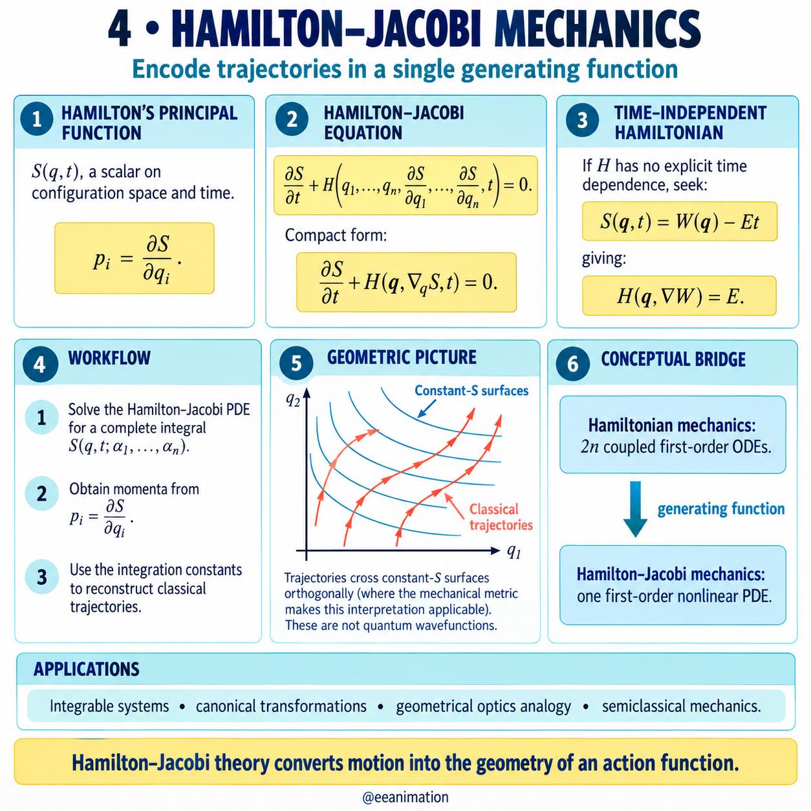

A differential equation is a constraint on a function and its
derivatives. In mechanics that function is a trajectory. The same
curve can be written as a second-order ODE in position, as a
stationary-action problem, as a first-order flow on phase space, or
as a first-order nonlinear PDE for a generating function.

This page is a map, not a textbook. Two galleries from
[@eeanimation](https://www.instagram.com/eeanimation/) carry the
pictures: a tour of dynamical-systems language, then four equivalent
formulations of classical motion.

## Topics of dynamical systems {#sec-dynamical}

Continuous time is $\dot x = f(x,t)$. Discrete time is
$x_{k+1} = F(x_k)$. The same vocabulary — equilibria, linearisation,
Lyapunov functions, bifurcations, Poincaré maps, chaos — asks whether
trajectories converge, oscillate, or become sensitive to the initial
state.

Carousel from
[22 September 2026](https://www.instagram.com/p/Ddlol_yG6q1/).
Click a figure to page through the lightbox.



## What we keep track of {#sec-state}

| Language | State | Typical equation |
|----------|--------|------------------|
| Newtonian | position $\mathbf r$, velocity $\dot{\mathbf r}$ | $\sum \mathbf F = m\ddot{\mathbf r}$ |
| Lagrangian | generalised coordinates $q_i$, velocities $\dot q_i$ | Euler–Lagrange |
| Hamiltonian | coordinates $q_i$, momenta $p_i$ | Hamilton's equations |
| Hamilton–Jacobi | principal function $S(q,t)$ | Hamilton–Jacobi PDE |

When the modelling assumptions match (holonomic constraints, a
regular Lagrangian, forces that the chosen language can express),
these formulations predict the **same** classical trajectories. They
do not emphasise the same structure.

## Worked motif: the simple pendulum {#sec-pendulum}

A mass $m$ on a massless rod of length $\ell$, angle $\theta$ from
the downward vertical. One generalised coordinate is enough.

Newtonian (tangential balance):

$$
\ddot\theta + \frac{g}{\ell}\sin\theta = 0.
$$

Lagrangian $L = T - V$ with $T = \tfrac12 m\ell^2\dot\theta^2$ and
$V = mg\ell(1-\cos\theta)$ yields the same ODE from the
Euler–Lagrange equation. The Hamiltonian picture replaces
$\dot\theta$ by $p_\theta = \partial L/\partial\dot\theta$ and
reads the motion as a curve in the $(\theta,p_\theta)$ plane.

## Four formulations of classical mechanics {#sec-gallery}

Five slides from
[10 September 2026](https://www.instagram.com/p/DdG5U50D_Hv/).
The post caption is the readable source; the slides drop spaces.

> Classical mechanics can be expressed through several equivalent
> mathematical formulations. Each predicts the same physical
> trajectories when its assumptions apply and the system is modelled
> consistently—but each emphasizes a different structure.
>
> Newtonian mechanics begins with forces:
> $\sum \mathbf F = m\ddot{\mathbf r}$.
>
> Lagrangian mechanics uses generalized coordinates, energy, and
> stationary action:
> $L=T-V$,
> $\frac{d}{dt}\bigl(\frac{\partial L}{\partial\dot q_i}\bigr)
> -\frac{\partial L}{\partial q_i}=Q_i^{(\mathrm{nc})}$.
>
> Hamiltonian mechanics replaces generalized velocities with
> canonical momenta and describes motion as phase-space flow:
> $\dot q_i=\frac{\partial H}{\partial p_i}$,
> $\dot p_i=-\frac{\partial H}{\partial q_i}$.
>
> Hamilton–Jacobi mechanics encodes the dynamics in Hamilton’s
> principal function $S(q,t)$:
> $\frac{\partial S}{\partial t}
> +H\bigl(q,\frac{\partial S}{\partial q},t\bigr)=0$.

::: {layout-ncol=2}

{group="eeanimation-classical" fig-alt="Four-column comparison of classical-mechanics formulations."}

{group="eeanimation-classical" fig-alt="Newtonian slide with Newton's second law and a simple pendulum."}

{group="eeanimation-classical" fig-alt="Lagrangian slide with action principle and pendulum Lagrangian."}

{group="eeanimation-classical" fig-alt="Hamiltonian slide with phase portrait of a harmonic oscillator."}

{group="eeanimation-classical" fig-alt="Hamilton–Jacobi slide with constant-S surfaces and trajectories."}

:::

Linearisation of a vector field is a
[linear-algebra](../linear-algebra/matrix-decompositions.qmd) job:
the local picture is $\dot x = Ax$.
